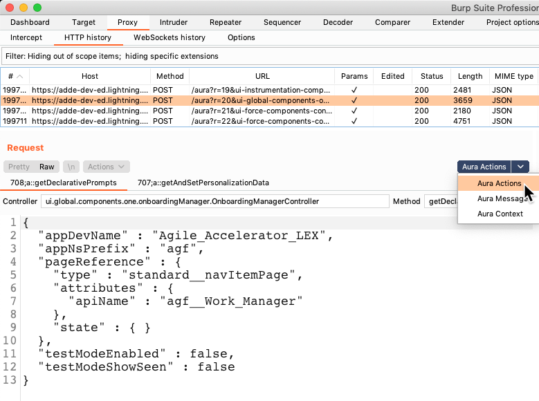

Burp Suite Lightning Plugin
--

A tool to help Burp better handle Lightning. Does URL decoding, and JSON parsing. 

Installs Aura tabs on HTTP message editors (Interceptor, Repeater, etc). Decodes and prettifies the aura actions, and makes params editable (will fall back to no editing if new update doesn't typecheck as JSON)

**HTTP Request UI**

##Building
`mvn clean install`

##Installing
In Burp Suite:
- Go to Extender -> Extensions -> Add
- Locate the compiled jar file (e.g. `target/LightningBurp-x.x.x-jar-with-dependencies.jar`)
- Click Open -> Next
